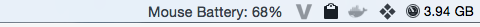

batteryPercentageMouse
======================

It shows Battery Percentage into Menu Extras from Mouse and Bluetooth Keyboard.

Screenshots
===========

Using Bluetooth Keyboard

Using Magic Mouse

Without any component with battery

Requirements
============

http://github.com/kareman/SwiftShell (deps resolved using Carthage)
